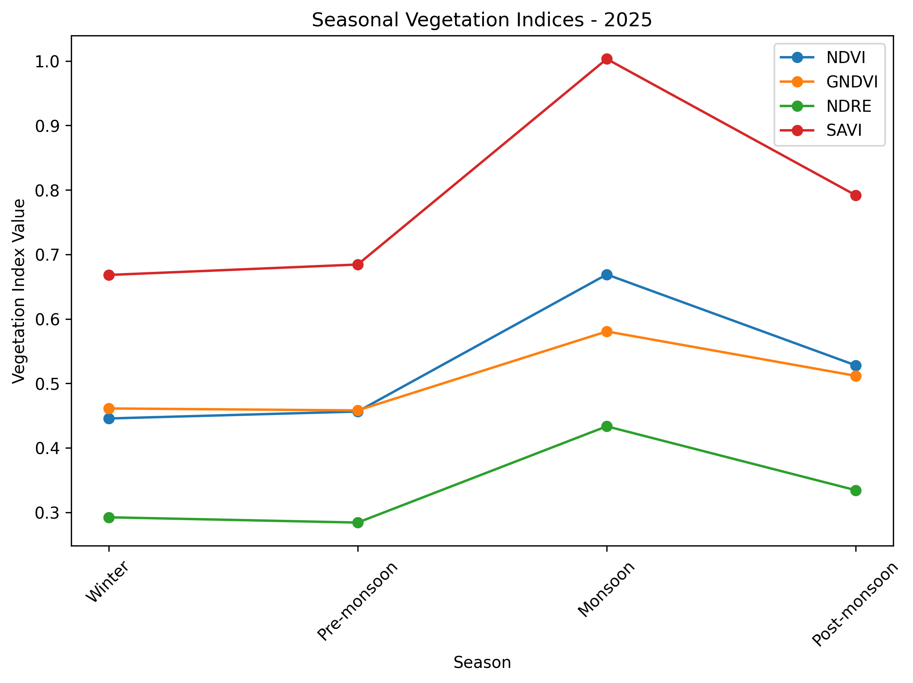
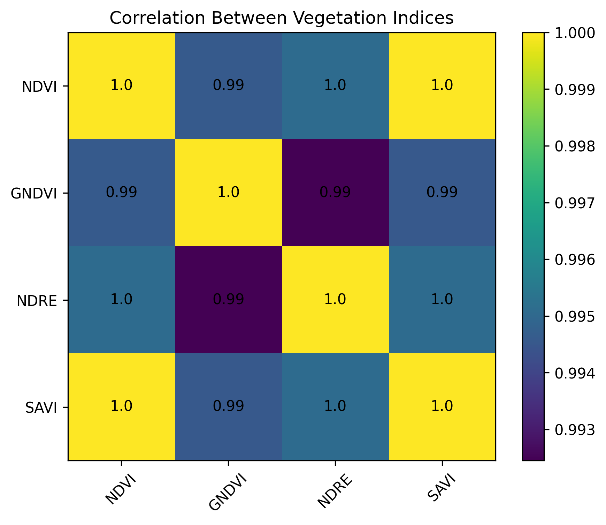
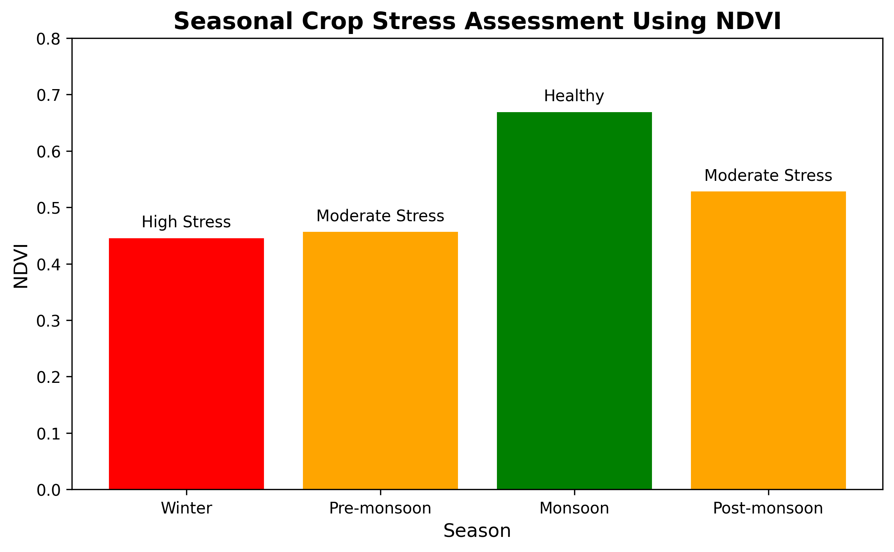

# 🌱 Monsoon Crop Stress Monitoring Using Sentinel-2 Remote Sensing

## Multi-Index Assessment of Seasonal Vegetation Dynamics in Changunarayan Municipality, Nepal (2025)

**Author:** Nisha Karki  
**Year:** 2026  

---

## 📌 Project Overview

Agricultural productivity is strongly influenced by seasonal environmental changes, especially during the monsoon period when excessive rainfall, cloud cover, and water stress can affect crop growth.

This project evaluates seasonal vegetation dynamics and crop stress conditions in **Changunarayan Municipality, Nepal** using **Sentinel-2 multispectral satellite imagery** and remote sensing-based vegetation indices.

The study integrates multiple vegetation indices to assess crop health, identify stressed areas, and develop a spatial crop condition classification map.

---

# 🎯 Objectives

The main objectives of this study were:

- To analyze seasonal vegetation dynamics using Sentinel-2 imagery.
- To calculate vegetation indices for crop health assessment.
- To evaluate monsoon crop stress conditions.
- To classify crop areas based on vegetation response.
- To generate spatial crop stress maps using Google Earth Engine.
- To develop a reproducible remote sensing workflow for agricultural monitoring.

---

# 📍 Study Area

**Location:** Changunarayan Municipality, Bhaktapur, Nepal  

The study area represents an agricultural landscape with mixed cropping systems, including seasonal crops influenced by monsoon rainfall patterns.

---

# 🛰️ Data Sources

## Satellite Data

**Sentinel-2 MSI Surface Reflectance**

- Spatial Resolution: 10–20 m
- Data Provider: Copernicus Sentinel Program
- Platform: Google Earth Engine

## Additional Data

- Municipal boundary shapefile
- Field-based agricultural information
- Remote sensing-derived vegetation metrics

---

# 🛠️ Software and Tools

| Tool | Purpose |
|---|---|
| Google Earth Engine | Satellite image processing and index calculation |
| Sentinel-2 MSI | Multispectral satellite data |
| Python | Data analysis and visualization |
| Google Colab | Computational environment |
| ArcGIS Pro | Spatial visualization and mapping |
| GitHub | Project documentation and sharing |

---

# 🌿 Methodology Workflow
---

# 📊 Vegetation Indices Used

## 1. NDVI (Normalized Difference Vegetation Index)

Used to assess overall vegetation vigor and biomass condition.

Formula:

NDVI = (NIR - Red) / (NIR + Red)

---

## 2. GNDVI (Green Normalized Difference Vegetation Index)

Sensitive to chlorophyll variation and vegetation nitrogen status.

Formula:

GNDVI = (NIR - Green) / (NIR + Green)

---

## 3. NDRE (Normalized Difference Red Edge Index)

Used for detecting crop stress and chlorophyll changes.

Formula:

NDRE = (NIR - Red Edge) / (NIR + Red Edge)

---

## 4. SAVI (Soil Adjusted Vegetation Index)

Applied to reduce soil background influence.

Formula:

SAVI = ((NIR - Red) / (NIR + Red + L)) × (1 + L)

where L represents soil adjustment factor.

---

# 📈 Seasonal Analysis

Vegetation response was evaluated across different agricultural seasons:

| Season | Description |
|---|---|
| Winter | Baseline vegetation condition |
| Pre-monsoon | Vegetation development before rainfall |
| Monsoon | Peak crop growth and stress assessment |

---

# 🌧️ Monsoon Crop Stress Assessment

A threshold-based classification approach was applied to categorize vegetation condition.

Classes included:

| Class | Interpretation |
|---|---|
| Healthy Vegetation | High vegetation activity |
| Moderate Stress | Reduced vegetation response |
| High Stress | Low vegetation activity |

---

# 🗺️ Results and Outputs

The project generated:

✅ Seasonal vegetation index maps  
✅ Crop stress classification map  
✅ Spatial distribution of crop conditions  
✅ GeoTIFF output for GIS analysis  
✅ Statistical comparison of vegetation indices  

---

# 📷 Figures

## Crop Stress Classification Map

## Seasonal Vegetation Indices

## Correlation Analysis

## Crop Stress Assessment

## Crop Stress Distribution

---

# 📂 Repository Structure
# 💻 Google Earth Engine Implementation

The complete Sentinel-2 preprocessing and vegetation index calculation workflow was developed in Google Earth Engine.

The script includes:

- Sentinel-2 image filtering
- Cloud masking
- Seasonal compositing
- Vegetation index calculation
- Crop stress classification
- Map export

GEE scripts are available in:
# 🔬 Key Findings

- Sentinel-2 vegetation indices successfully captured seasonal crop variability.
- NDVI, GNDVI, NDRE, and SAVI provided complementary information for crop condition assessment.
- Monsoon conditions showed spatial variation in vegetation stress patterns.
- Remote sensing-based monitoring can support rapid agricultural assessment.

---

# 🌱 Applications

This workflow can support:

- Precision agriculture
- Crop monitoring
- Early stress detection
- Agricultural decision-making
- Climate-resilient farming practices

---

# 🚀 Future Improvements

Future work can include:

- Integration of crop type classification models
- Machine learning-based stress prediction
- UAV-based validation
- Field-level crop yield analysis
- Multi-year monitoring

---

# 📚 Skills Demonstrated

- Google Earth Engine
- Sentinel-2 Remote Sensing
- Vegetation Index Analysis
- GIS Mapping
- Agricultural Monitoring
- Spatial Data Processing
- Precision Agriculture Applications

---

# 📜 License

This project is created for academic and research purposes.

---

# 📬 Contact

**Nisha Karki**  
Research Assistant | Remote Sensing & Precision Agriculture Enthusiast

GitHub: https://github.com/NishaKarki-Tech
